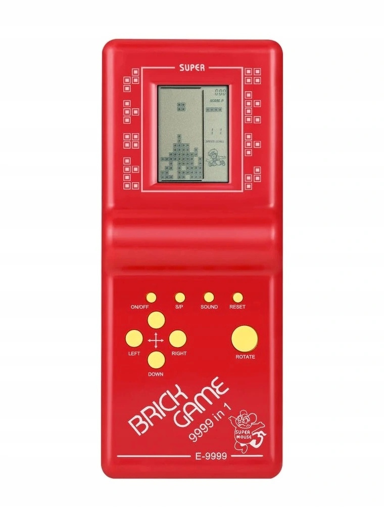
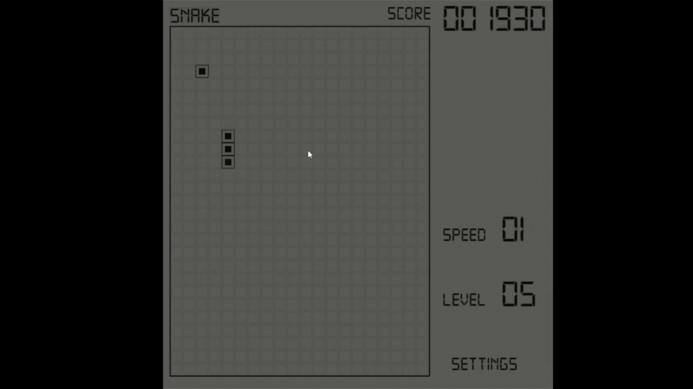
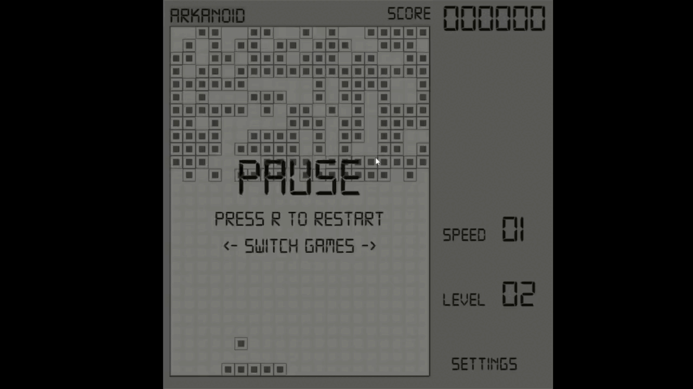
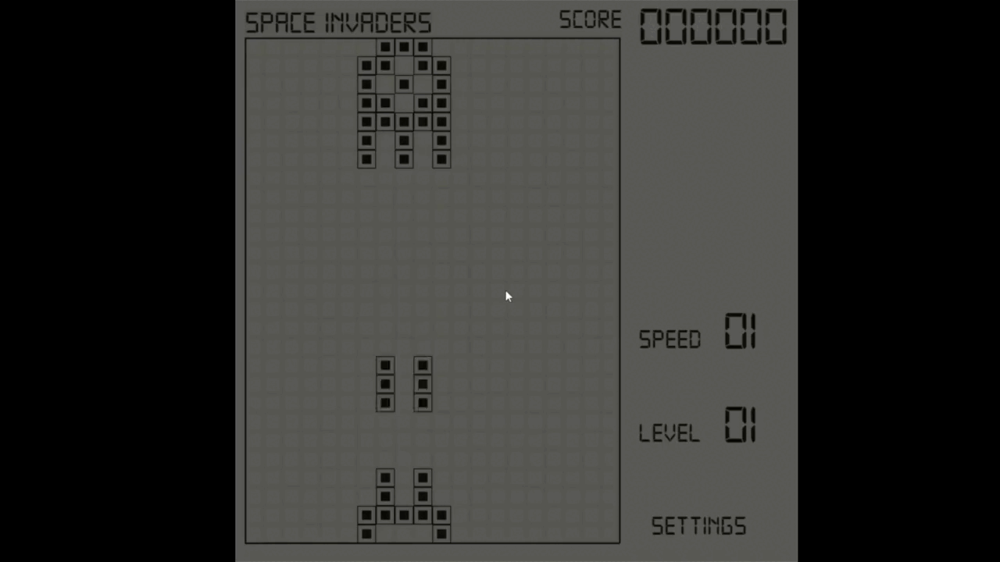
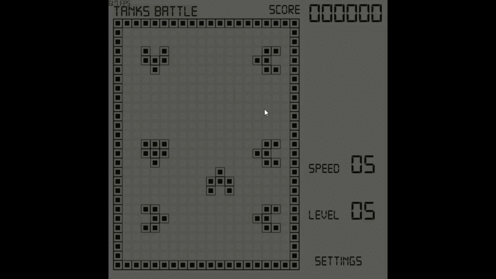

# BrickGame Ultra XXX #
(improved interpretation of my childhood's portable console 
__"BrickGame 9999 in 1"__)
***
Original game looked like this:

***
Some raw preview
(might be outdated):

***
### To Do: ###
Games:
- [x] Snake
- [x] Arkanoid
- [x] Space Invaders (sort of)
- [x] Racer games
- [x] Tanks battle
- [ ] Tetris
- [ ] Pong

Improvement:
- [x] Add animations and more enjoyable look
- [ ] Add enjoyable sounds and music
- [ ] Get sound and music settings work
- [ ] Add interesting variations to all games
- [ ] Make each game more interesting and entertaining
- [ ] Add more variations to all games
- [ ] Implement level and speed systems in all games
- [ ] Implement resolution scaling for each game (might be one of the last things to do)
***
### Contacts:
* [Telegram](https://t.me/crawlic)
* [VK](https://vk.com/ovalmercyy)
