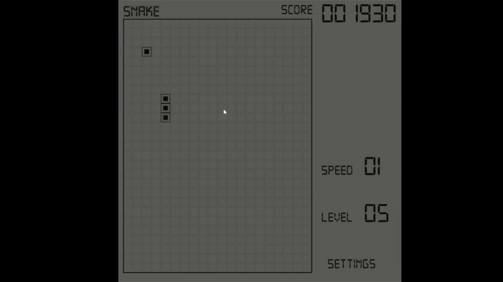
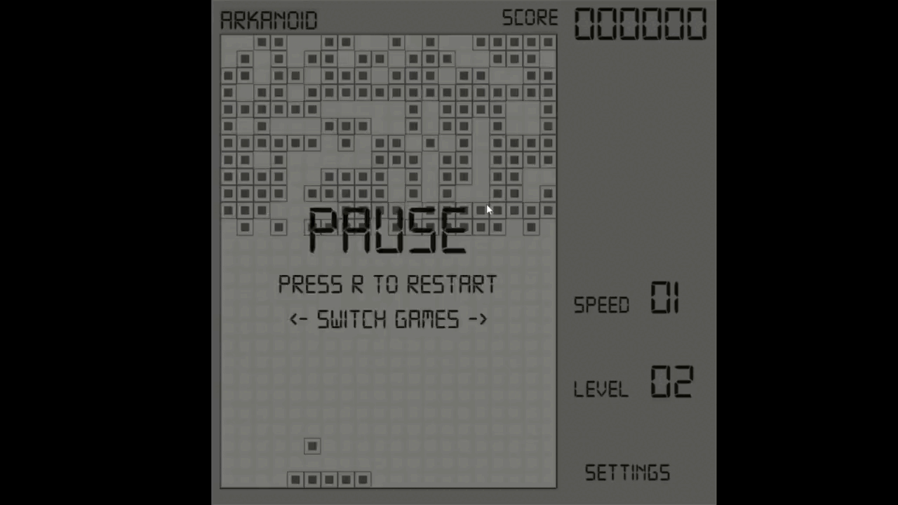
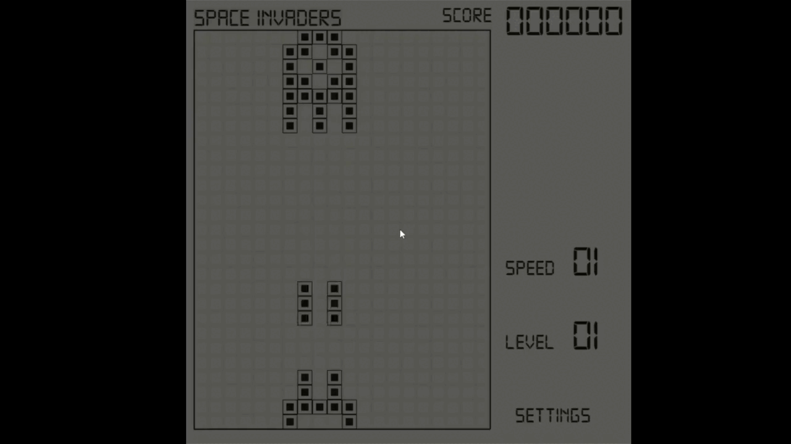
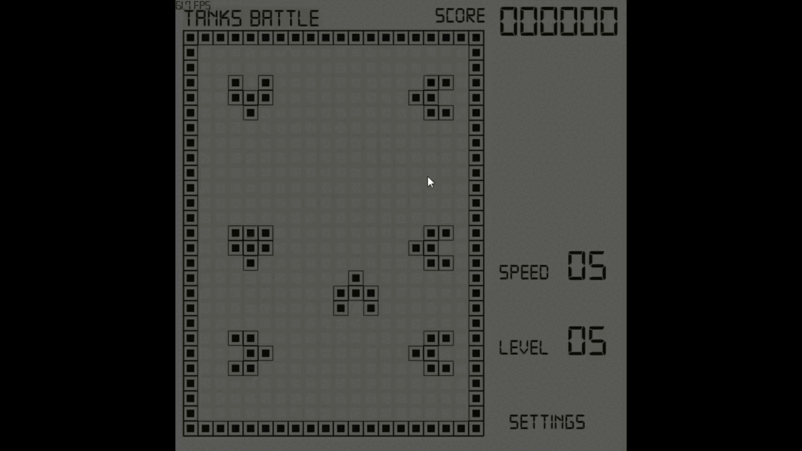
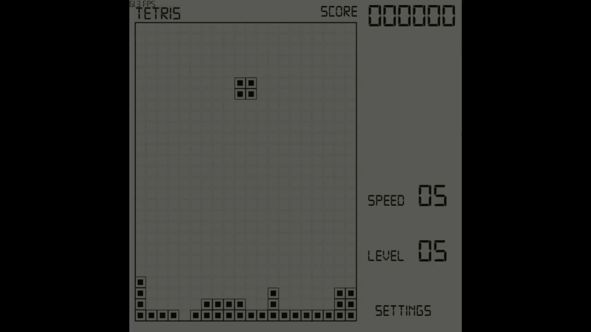

# BrickGame Ultra XXX #
(improved interpretation of my childhood's portable console 
__"BrickGame 9999 in 1"__)
***
Some raw preview:

***
### To Do: ###
Games:
- [x] Snake 
- [x] Arkanoid 
- [x] Space Invaders (sort of)
- [x] Racer games
- [x] Tanks battle
- [x] Tetris
- [ ] Pong

Improvement:
- [x] Add animations and more enjoyable look
- [x] Add enjoyable sounds and music
- [x] Get sound and music settings work
- [ ] Make each game more interesting and entertaining
- [ ] Add more variations to all games
- [x] Implement level and speed systems in all games
- [ ] Implement resolution scaling for each game (might be one of the last things to do)
***
### Contacts:
* [Telegram](https://t.me/crawlic)
* [VK](https://vk.com/ovalmercyy)
